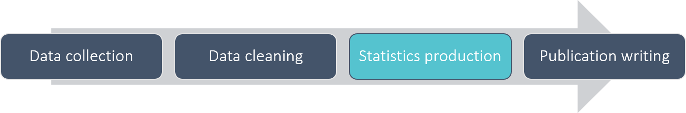

```{r xaringan-themer, include=FALSE}
library(xaringanthemer)
style_duo(
  primary_color = "#1F4257", 
  secondary_color = "#F97B64",
  header_font_google = google_font("Poppins", "400"),
  text_font_google   = google_font("Poppins", "250", "250i"),
  code_font_google   = google_font("IBM Plex Mono")
  )
```

```{r setup, include=FALSE}
library(knitr)
library(showtext)
library(xaringan)
library(rmarkdown)
library(magrittr)
library(data.table)
knitr::opts_chunk$set(echo = FALSE)
knitr::opts_chunk$set(error = FALSE)

data_example1 <- fread("examples/sen_age_gender_snippet.csv", colClasses = "character", na.strings = NULL) %>% .[,1:14]

```

# What I'll cover

--

- Our plan for implementing RAP - setting the scope and details

--

- Work so far - setting a plan, documentation, dissemination platform

--

- Focused example - automated screening of data files against standards

--

- Next steps - automating QA more widely

???

Test notes for myself

---

class: inverse

# What is RAP

--

Don't worry, I'm not going to preach the choir here

--

This was critical to start off with - we couldn't start being effective until we knew what RAP looked like for us

--

In order to do that, we clearly defined the scope of it...

.center[]

---

# What is RAP

Our overview:

.center[]

---

class: inverse

# What is RAP

Our diagram for what this means in practice:

.center[]

---

class: inverse

# Explore Education Statistics

A big part of this has been utilising the new dissemination platform as a catalyst

--

Change was already coming, therefore it was an ideal time to jump on the back of it to make that change an even better and deeper one

--

Our data files had to be standardised to run the platform off of the aggregated data

This meant that we could get senior managers to enforce analysts using EES, and therefore indirectly enforce any standards we set for data that had to go on there

--

Brief demo of [Explore Education Statistics](https://explore-education-statistics.service.gov.uk/)

---

class: inverse

# Guidance

A key part of RAP is documentation, and implementing RAP has been no different

--

We have an [rmarkdown website](https://rsconnect/rsc/stats-production-guidance/) where all of our guidance is stored

--

Note that this is not publicly accessible, it is limited to DfE only as it runs off of our rsconnect servers

---

# Data standards

Built around principles of tidy data

--

Essentially:

- Every row refers to a single observational unit
- Every column refers to a single variable 
-- 'filters' for categorical variables
-- 'indicators' for the numeric measures that we report
- Specific standards around time and geography so the that platform can handle them

--

Example 1

```{r data_example1}
knitr::kable(data_example1, 'html')
```


--

Benefits 

- Machine readable
- 3* open data standards
- Consistent across totally different areas (show second example)


--

Still have debates now, where is the line between levels of categorical variable and a separate measurable variable, balance between 'molten' and 'tidy'.

--

It's been a battle at times as you can imagine, though we've aimed to give analysts as much flexibility as we can within the constraints.


---

# Now we have standards, how can we check against them?

Example standards to check for

Me manually checking 

Motivation for tool
- Save time
- Accuracy
- Reliability
- Remove single-person dependency
- Empower analysts to do this themselves

Design and usage 

How it's evolved based on feedback

The feedback I've had

---

# Notes to fit in

User focus
- Allowing analysts to take advantage of RAP without the barrier of technical knowledge
- Fear of RAP and R and code


---

# First iteration

Basic checks in an Rscript

Output in console

Run by myself, and manually fed back to teams

A number of things to improve, though one I'll highlight is how the tests could fail early, which goes against the best practice in automated testing where you want maximum coverage, so that you can get as much useful information as possible, and minimise the need to rerun - I'll come back to this later

---

# Second iteration

--

Rmarkdown report to send to analysts 

--

- Version controlled using git, in a public github repo

--

- Saved me time manually checking through results

--

- Gave an audit trail of the screening for future reference

---

# Third iteration

Similar structure, with more tests, summary stats and a console only option for larger files

--

- More useful information to see at a glance (progressive disclosure and whatnot)

--

- Increased speed/efficiency, particularly when initially testing data and getting fails

--

- First time starting to think about the length of time the code takes to run as file sizes increased

--

- Using renv for package handling

---

# Setup video

I found that I was spending hours of my time going through with analysts setting this up, repeating the same things over and over

--

So rather than constantly doing the verbal equivalent of repeating the same code over and over, I recorded a 10 minute youtube video instead

--

- Walked through everything from getting the correct R and RStudio versions from the software centre to understanding the reports that came out

--

- Saved myself sitting beside each of the analysts at their desks to do this

--

- Proved very popular, empowering analysts, and effective in reducing repetitive queries to me

--

- I'm also fairly sure that this alone dramatically increased the number of publication teams who had a version of R/RStudio on their machines in our department

---

# renv

As great as renv is, there were still issues with it, it wasn't working for everyone, and I ended up scrapping it in favour of this temporary solution to tide me over until the next iteration came along

- Code

---

# Current iteration 

Shiny app

--

- Back to renv

--

- Removes R and Rstudio barrier

--

- Reduces dependency issues to server only, rather than 100+ different laptops

--

- Single version of the truth, no need to redownload/pull latest version

--

- Increased speed - using profvis to profile code, highlight slowest parts and refactored accordingly

--

- Increased test coverage - now 60 checks and counting,0 with preliminary stages to allow for maximum coverage while minimising confusing cross-errors where possible


--

- Automated tests using testthat and shinytest that run locally to automate the testing of any new code that goes into the app

---

# Particularly useful tests

--

Do as separate pages with code for the test underneath

- Duplicate rows - `janitor::get_dupes()` - almost scary how many analysts started to notice things in their data after I added this test

--

- Utilising a matrix to run geography checks against rather than a mass of if this then that

--

- White space, it can lead to so many issues, and can be impossible to spot manually

--

- profvis - for spotting unnecessary uses of `grepl()`, where `vector_of_values %in% dataset$column` would suffice, along with `use.names = FALSE` for `unlist()`, incredible time savings

--

- testthat and shinytest, both very easy to use and quick to set up, saves a tonne of time fixing the same mistakes - rprofile function

--

- styler - though make sure you're version controlling - rprofile function

--

- Commenting in a way to make use of the outline as scripts get longer - Ctrl-Shft-O in RStudio

---

# Next steps

--

Integrate automated tests into DevOps - have struggled so far, though looking at options

--

Automated QA / sense checking in app if a file passes

--

Continue to build on documentation, and features/code to help analysts make the most of RAP

--

Further work to push this with our HoP, and get pressure from the top to actively do this


---

# Recap

In some ways, you could say it's been quite simple:

--

- Defined what 'RAP' was to us
- Targetted specific areas of that plan
- Iterated the solutions based on feedback
- All the while learning more and more about R and what can be done with it
- Keep pushing to improve moving forwards

???

All of the standard things that any project should do, however, the more interesting bit is the challenges we faced

---

# Recap

--

3 biggest challenges

--

1. Understanding why things are the way they are

???
This can be particularly tough. It's easy to look at a group of analysts and spot how their processes could be improved, it's much harder to look at why what they are doing may actually be the best way for them

--

2. Working out how to effectively implement RAP using knowledge of 1.

???
Once you have the knowledge of why things are the way they are, you can then decide the best ways to change that, for us that has meant constantly adapting and trying to lower the barrier to RAP, while also continuing to encourage and push people to learn and develop this themselves

--

3. Having a limited resource pool and many knowledge barriers (both personally and around our division - see 1. and 2.)

???
I personally started this with limited knowledge, the extent of which was pretty much that basic code I showed you 

So I've been learning throughout, and that challenge has been an enjoyable one

A trickier part however has been the lack of knowledge around our area, and how even things such as getting RStudio onto someones machine can prove challenging

--

Ultimately all have been overcome by a lot of effort, though it's not always simple or easy...

---

class: center, middle

# Thanks!

Slides available at [...]()

Made with [xarigan](https://bookdown.org/yihui/rmarkdown/xaringan.html) rmarkdown extension

Any questions?

Contact: [cameron.race@education.gov.uk](mailto:cameron.race@education.gov.uk)

???

Thank you all for listening

Slides are available at that link there

This was made with xarigan package, which is an extension for rmarkdown, and I'd really recommend you check it out, the amount of flexibility is incredible and the keyboard shortcuts are really nice when presenting

I think there's a few minutes now if anyone has any questions, though there's also my email there if you have questions or suggestions afterwards
